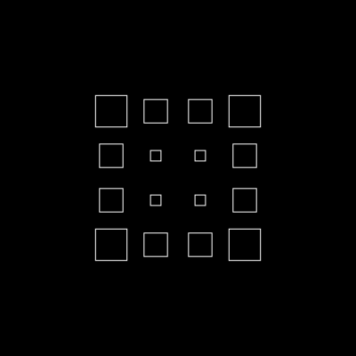

## Sinossi

Questo pacchetto è il core utilizzato dalla libreria javascript Urpflanze per la generazione della scena.
Si occupa di creare forme bidimensioni, ripeterle, manipolarle e incapsularle.
Puoi utilizzarlo nel browser o in node.

## Motivazioni

La creazione di questa libreria nasce dall'esigenze di creare delle API semplici per
gestire le ripetizione di forme primitive e la possibilità di applicare trasformazioni ad ognuna di esse.

Un'altra esigenza - che poi è diventata una delle feature principali - era quella di poter incapsulare il risultato di una generazione e gestirla come se fosse una nuova forma.

## Installazione

Puoi installare la libreria con il comando

```bash
npm i @urpflanze/core --save
```

Al termine è possibile importare Urpflanze nel tuo progetto

```javascript
/**
 * Full importing
 */
import * as Urpflanze from '@urpflanze/core'

const scene = new Urpflanze.Scene()

/**
 * Selective import
 */
import { Scene } from '@urpflanze/core'

const scene = new Scene()
```

## Creazione di una forma

### ShapeBuffer

La _ShapeBuffer_ è la forma a cui puoi passare un buffer di punti.
Essa accetta la proprietà **shape** che è un array di punti [x0, y0, x1, y1, ..., xn, yn].
L'Array di punti verrà adattato tra un range di -1 ed 1.

Example:

```javascript
import { ShapeBuffer } from '@urpflanze/core'

const rect = new ShapeBuffer({
	shape: [-1, -1, 1, -1, 1, 1, -1, -1],
	sideLength: [10, 10],
})

rect.generate() // Apply properties

console.log(rect.getBuffer())

// Output:
// Float32Array(8) [
//   -10, -10,  10, -10,
//    10,  10, -10, -10
// ]
```

### ShapeLoop

La _ShapeLoop_ è una forma generata pertendo da un ciclo,
è consigliato restituire i valori tra un range di -1 ed 1

```javascript
import { ShapeLoop } from '@urpflanze/core'

const circle = new Urpflanze.ShapeLoop({
	sideLength: [10, 10],
	loop: {
		start: 0,
		end: Math.PI * 2,
		inc: (Math.PI * 2) / 100, // (end - start) / 100 for generate 100 points
		vertex: shapeLoopRepetition => [
			// shapeLoopRepetition.current start from 0 and end to 2 PI,
			// so you can use it as a angle
			Math.cos(shapeLoopRepetition.current),
			Math.sin(shapeLoopRepetition.current),
		],
	},
	bClosed: true, // flag to determinate the shape is closed
})

circle.generate()

console.log(circle.getBuffer().length)

// Output:
// 200 / 2 = 100 points
```

## Forme primitive

In questo pacchetto sono già presenti delle forme di base:

#### ShapeBuffer

[`Line`](docs.urpflanze.org/core/#/ref/Line)
[`Triangle`](docs.urpflanze.org/core/#/ref/Triangle)
[`Rect`](docs.urpflanze.org/core/#/ref/Rect)

#### ShapeLoop

[`Polygon`](docs.urpflanze.org/core/#/ref/Polygon)
[`Circle`](docs.urpflanze.org/core/#/ref/Circle)
[`Lissajous`](docs.urpflanze.org/core/#/ref/Lissajous)
[`Spiral`](docs.urpflanze.org/core/#/ref/Spiral)
[`Rose`](docs.urpflanze.org/core/#/ref/Rose)
[`SuperShape`](docs.urpflanze.org/core/#/ref/SuperShape)

## Ripetizioni

Con Urpflanze puoi ripetere le forme in modo circolare o a matrice.

### Ripetizioni circolari

Per questo tipo di ripetizioni puoi settare un valore numerico alla proprietà `repetitions` per indicare il numero di volte che dovrà ripetersi e la proprietà `distance` per indicare la distanza dal centro.

```javascript
new Urpflanze.Rect({
	repetitions: 8,
	distance: 100,
	sideLength: 25,
})
```


Di base le forme verranno ruotate verso il centro, se si vuol evitare quest'effetto bisogna ruotare la vorma inversemente all'angolo corrente della ripetizione.

```javascript
new Urpflanze.Rect({
	repetitions: 8,
	sideLength: 25,
	distance: 100,
	rotateZ: ({ repetition }) => -repetition.angle,
})
```


### Ripetizioni a matrice

Per ripetere la forma come una matrice basterà passare alla proprietà `repetitions` un Array di numeri che indicano il numero di righe e di colonne. Anche la proprietà `distance` in questo caso sarà un Array contenente la distanza tra le righe e le colonne.

```javascript
new Urpflanze.Rect({
	repetitions: [3, 4],
	sideLength: 20,
	distance: [80, 50],
})
```


## Gestire le ripetizioni

Per gestire le ripetizioni possiamo passare alle proprietà una funzione al posto di una costante. Possiamo l'argomento della funzione che è di tipo [ISceneChildPropArguments](https://docs.urpflanze.org/urpflanze/#/ref/ISceneChildPropArguments).

Ogni oggetto che estende una IBaseRepetition contiene le seguenti proprietà:

- `index` l'indice corrente, da 1 a count
- `count` il numero totale di ripetizioni
- `offset` un indice che va da 0 ad 1 che non dipende dal numero di ripetizioni. Ad esempio, se il numero di ripetizioni sono 3, il valore di offset sarà 0 - 0.5 - 1

### Esempi

```javascript
new Urpflanze.Rect({
	repetitions: 8,
	distance: ({ repetition }) => repetition.offset * 100,
	scale: ({ repetition }) => repetition.offset,
	sideLength: 25,
})
```


```javascript
new Urpflanze.Rect({
	repetitions: [5],
	sideLength: 25,
	distance: 50,
	scale: ({ repetition }) => {
		return Urpflanze.distanceFromRepetition(repetition, [0, 0])
	},
})
```



## Incapsulamento

## Ricorsione

## Aggiunta alla scena e Animazioni
